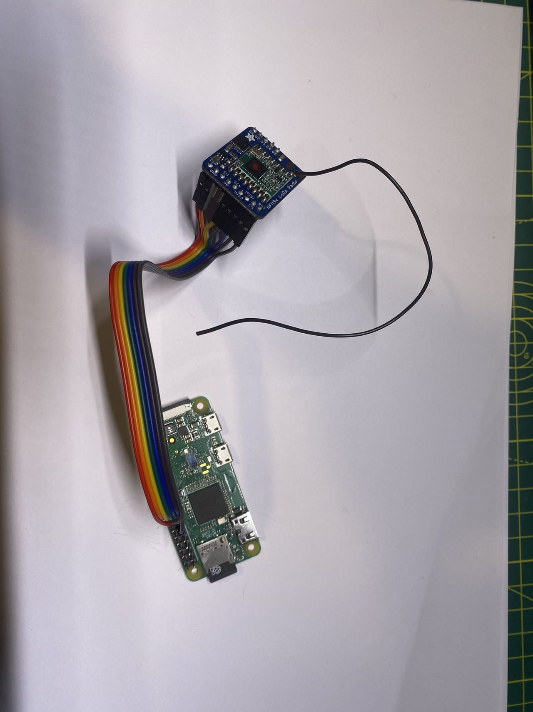
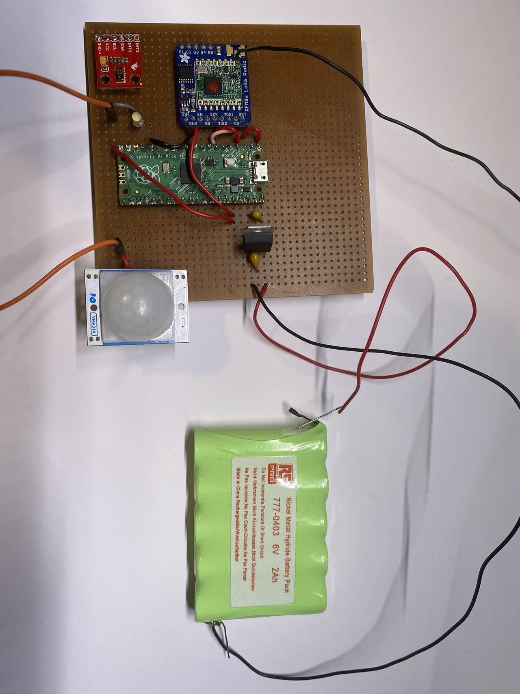

Hardware Installation
===

To utilize the SenosrPi, components below is necessary.

1. A Raspberry Pi SBC (As Gateway)
2. A Raspberry Pi Pico CMU(As Sensor Node)
3. Two LoRa RFM9X Radio
4. Peripheral Sensors

## Pin Mappings
The Submitted Sensor Node and gateway is already functioning. Here is the Component Pin Mappings.

### Gateway
The gateway only comprises A raspberry pi zero and a LoRa RFM9X Unit. RPI Zero and RFM9X connected as follows.

| RFM9X | RPI Zero| 
|-------------|
| Vin|3V3 Power| 
|GND|GND|
|EN| - |
|G0|-|
|SCK| SPI0 SCLK(GP11)|
|MISO|SPI0 MISO(GP9)|
|MOSI|SPI0 MOSI(GP10)|
|CS| GP22| 
|RST|SPI0 CE1(GP7)|
|G1|-|
|G2|-|
|G3|-|
|G4|-|
|G5|-|

## A Gateway Example

### Sensor Node

| RFM9X | RPI Zero| 
|-------------|
| Vin|3V3 Power| 
|GND|GND|
|EN| - |
|G0|-|
|SCK| SPI0 SCLK(GP11)|
|MISO|SPI0 MISO(GP9)|
|MOSI|SPI0 MOSI(GP10)|
|CS| GP22| 
|RST|SPI0 CE1(GP7)|
|G1|-|
|G2|-|
|G3|-|
|G4|-|
|G5|-|

## A Sensor Node Example 

StartUp
===
## Gateway 

### Materials
1. a MicroUSB data cable.
2. A computer with ssh.

The Hardware Raspberry Pi Setup has already install all dependencies and ready to use.

### Steps
To start the gateway, you first need to connect the Raspberry pi zero with computer using the data port in raspberry pi zero. The data port could also power up the Raspberry Pi zero.

Then, use serial communication tools such as PUTTY or Builtin ssh commandline tools, connected to the Raspberry Pi with

Username: pi

Password: raspberry

''' ssh pi@raspberrypi.local '''

When successfully connected
'''
cd sensor_zero_bk
python3 ./main.py
'''

Then, a simple command line tools is ready in your shell.

'''
SensorPI >> 

'''
Here, the sensor pi is waitin for your command.

Now, we have several simple function support:
| Functions | command |
|-| 
|Print All Connected Sensor Nodes| list |
|Print Data From Specific Sensor Node| print <Device_ID>|
|Save all Sensor Data to log.txt| save |

before the Sensor node is ready, you can't see any respond from all these commands.

Now, the Gateway is ready to use.

## Sensor Node.
There are two ways of starting the Sensor Node

### Start Up 
#### Battery
You can use a 6V Battery to operate the device.
You just need to connect the Black cable to the negative side of the battery and Red Cable to the positive side.

#### Microusb
 Use another Microusb cable and connected raspberry pi pico to the computer or any power source(E.g Powerbank), the sensor node should working

### Debug
 The Sensor Node has its own serial output for debugging. You can connect the raspberry pi pico in the sensor node to computer, and check the serial output from the Sensor Node.

### Cnnection Check
To assure you the Sensor Node is working, the LED light will light up. You can check the Connection between sensor node and gateway in the gateway side. In the gateway command line tool, type '''list''' to check the connection. If the device is successfully connected, you can find a sensor node in the shell. In this example, the device ID of this sensor node is 18

Functions
===

After Setting Up, you can see the sensor readings by entering command in gateway command line tools. Use our sensor node with device id 18 as an example

'''
print 18
'''

Then, the data sending from Sensor node will be printed in shell. you can save them whenever you want by typing save command
'''
save
'''
Once you save it, you could see a log.txt file in your folder.

File Strcuture
==
<pre>
├─images                                -- Images use in Mardown file.
├─SensorPi                              -- SensorPi Codes
├─sensor_pico                           -- Sensor Node Codes
│  ├─demo
│  │  └─hello_world
│  │      └─lib
│  │          └─adafruit_bus_device
│  └─src    
│      └─lib
│          └─adafruit_bus_device    
├─sensor_zero                           --Gateway Codes
|   ├─src 
└─adafruit-circuitpython...8.0.4.uf2    --Circuitpython for Pico
</pre>

The **SensorPi** directory contain files that will be used in both Sensor Node and Gateway. The files are related to the communication protocol implementation.

The **sensor_pico** directory contains the source code of SensorPi in sensor_pico/src file. the structure of the code is the same as the CircuitPython required structure. You can just copy and paste all files to the root directory of CircuitPython. In sensor_pico/demo, there is a simple demo to show how to build a SensorPi device code from the skeleton.

The **sensor_zero** direcotry contain the source code of the gateway.

The detailed implementation and purpose of the file is in the top of each file. 